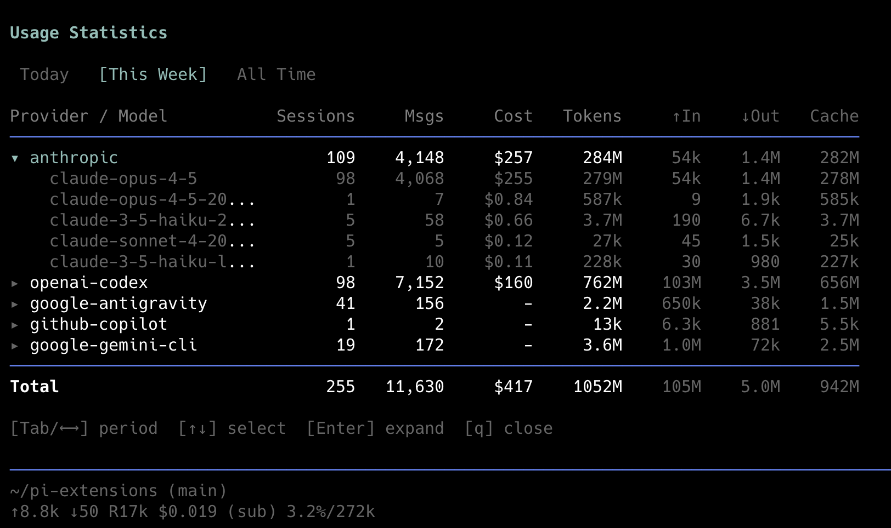

# dm-usage

Bundled DM extension that adds `/usage`, an interactive dashboard for local session cost, token, provider, and model usage.

## Included command surface

- `/usage`
- `/usage use [provider-id|clear|remove <provider-id>]`
- `/usage show`
- `/usage rotation`
- `/usage verify`
- `/usage path`
- `/usage reset [manual|quota|all]`
- `/usage help`

## Runtime notes

- Reads session JSONL files recursively from `~/.dm/agent/sessions/`.
- Respects `DM_CODING_AGENT_DIR`; `PI_CODING_AGENT_DIR` is accepted only as a compatibility fallback.
- Displays raw provider `openai-codex` as `duckmind-ultra` and `openrouter` as `duckmind-standard` without changing recorded session data.
- Restored account-tool subcommands keep local managed-account metadata in `~/.dm/agent/usage/state.json`; they do not store API secrets or route provider requests.
- `Tab` / `←` / `→` switch periods, `v` toggles table/insights view, and `q` / `Esc` closes the dashboard.
- Cost data comes from recorded assistant usage payloads, so accuracy depends on providers reporting `usage.cost.total`.

## Bundled with dm

No separate install step is required. Install `dm`, then run `/usage` inside the TUI.
